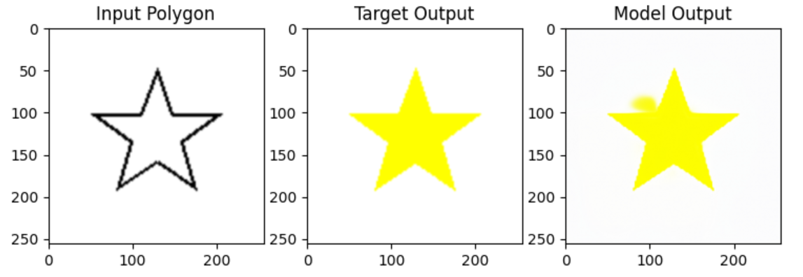
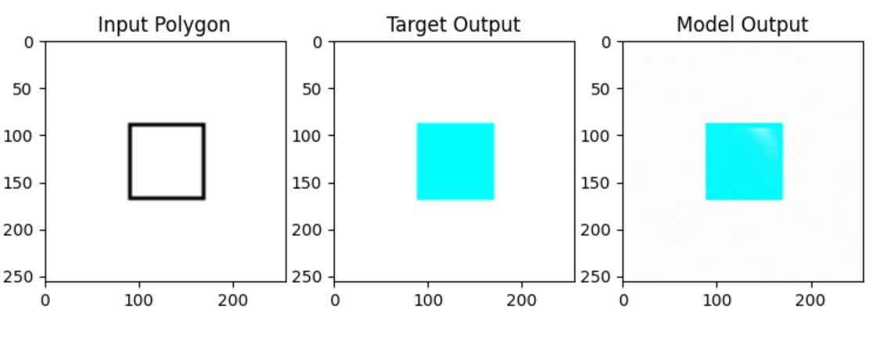
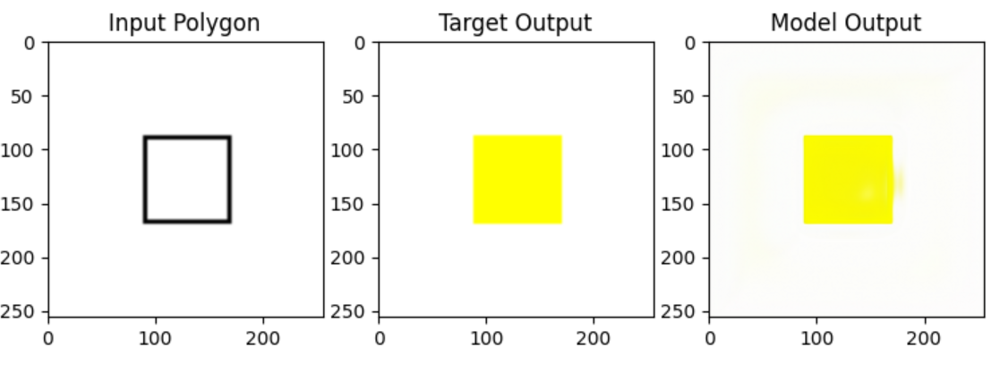
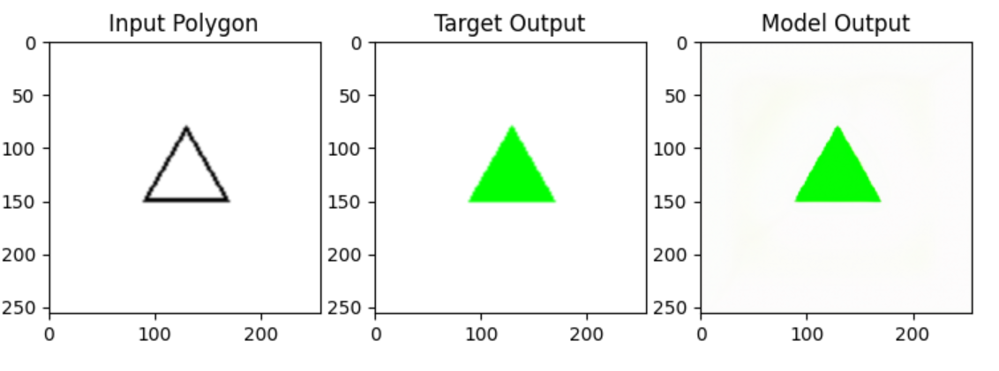

# Ayna-ML-Assignment

## Polygon Colorization via Robust Conditional UNet

### 🛤️ Methodology & Evolution

Our conditional polygon colorization system was built and improved through six major iterations, progressively fixing each observed limitation until robust, color-accurate results were obtained:

#### 1. Vanilla UNet (No Conditioning)

* **Technique**: Standard UNet with only the polygon outline as input.
* **Problem**: No way for the user to specify the desired color—the model always output the average/most common color.
* **Outcome**: Model reliably filled shapes, but with no color control.

#### 2. Color Embedding + FiLM at Bottleneck

* **Technique**: Added a color index and learned embedding, injected at the UNet bottleneck through FiLM (feature-wise linear modulation).
* **Problem**: Conditioning was too weak/late; colors were sometimes incorrect or swapped.
* **Outcome**: Better, but still some color mistakes and lack of robust control.

#### 3. Unified color2idx Mapping

* **Technique**: Standardized a single color2idx mapping dictionary throughout encoding/training/validation/inference.
* **Problem**: Prevented color swaps due to inconsistent index mapping between splits.
* **Outcome**: Stable color-to-index consistency and less confusion.

#### 4. Embedding Concatenation at Input + FiLM at Bottleneck

* **Technique**: Color embedding map concatenated to image channels at input and FiLM applied at the bottleneck.
* **Problem**: Earlier and deeper color conditioning eliminated most issues; model could now fill any shape with any requested color.
* **Outcome**: Robust, strong color-conditional generation.

#### 5. Hybrid Loss & Explicit Color Classification Head

* **Diagnosis**: Occasionally, merely using L1/pixel loss permitted small but consequential color errors, especially with visually “close” colors.
* **Solution**:

  * **Hybrid Loss**: Combined L1 pixel difference (for shape and structure) with Cross-Entropy loss (for explicit color class correctness).
  * **Architecture**: Added a "color classification head" at the bottleneck, predicting the color from learned features in parallel with image output.
  * **Model Output**: Forward method returns both the colorized image and the color class logits.
  * **Training**: The final loss is `L1_loss + CrossEntropy_loss` to strongly penalize color mistakes even when structural loss is small.
* **Outcome**: The model now yields perfectly color-accurate and shape-accurate results—robust to all color-shape combinations, no color confusion, and strongest overall performance.

#### 6. Multi-Resolution Discriminator for Realism

* **Diagnosis**: Though color and structure were accurate, outputs sometimes lacked sharpness or realism in edge boundaries.
* **Solution**:

  * Introduced a **multi-resolution PatchGAN discriminator** as part of an adversarial setup to critique realism.
  * Trained the generator (UNet) and discriminator jointly, using **adversarial loss** in addition to hybrid loss.
* **Outcome**: Enhanced edge fidelity and perceptual quality, preserving color conditioning and improving visual sharpness across fine structures.

### Summary Table of Iterative Improvements

| Iteration | Change                                         | Problem Addressed                       | Outcome                               |
| --------- | ---------------------------------------------- | --------------------------------------- | ------------------------------------- |
| 1         | Baseline UNet, no color input                  | No way to pick output color             | Model outputs average color           |
| 2         | Color embedding + FiLM at bottleneck           | Weak, late conditioning                 | Partial color control, mistakes       |
| 3         | Unified color2idx mapping, balanced sets       | Color swap confusion                    | Stable mapping, correct color use     |
| 4         | Embedding concat as input + FiLM at bottleneck | Weak/late conditioning, mode collapse   | Robust, accurate color fills          |
| 5         | Hybrid loss + color classification head        | L1 loss insufficient for color accuracy | Best color accuracy, perfect fills    |
| 6         | Multi-resolution discriminator + GAN loss      | Output realism and sharpness            | Realistic, sharper and faithful fills |

---
## 🎨 Sample Colorization Results

Here are some output samples generated by the final model:

| Sample        | Result Preview |
|---------------|----------------|
| Yellow Star   |  |
| Blue Square   |  |
| Yellow Square |  |
| Green Triangle|  |

---

### 📄 Best Practices and Lessons Learned

* **Condition early and often**: Concatenate color embedding at input and inject at bottleneck.
* **Maintain consistent label mappings**: One `color2idx` mapping always.
* **Hybrid loss is crucial**: Using both L1 (for structure) and cross-entropy (for color correctness) maximizes fidelity.
* **Explicit color head guides learning**: Classification loss makes the model “care” about getting the color exactly right.
* **Adversarial training refines sharpness**: GAN loss helps improve visual quality.
* **Balance data**: All color/shape combos must be present to ensure generalization.

---

### 🛠️ Final Model Configuration (6th Iteration)

* **Architecture**: Custom Conditional UNet (Generator) + Multi-resolution PatchGAN Discriminator

  * **Input**: \[Batch, 3 (RGB) + EmbeddingDim, H, W]: image and broadcasted color embedding
  * **Color Conditioning**: Embedding via `nn.Embedding`, used both as input concatenation and FiLM scale/bias at bottleneck
  * **Color Classification Head**: Predicts color class at bottleneck
* **Loss**: `L1_loss + CrossEntropy_loss + GAN_loss`

#### Hyperparameters

* Learning Rate: 1e-3
* Batch Size: 16
* Epochs: 200
* Color Embedding Size: 64

#### Metrics

* L1 validation loss

* SSIM

* Color classification accuracy

* GAN loss curve

* **Experiment Tracking**: Weights & Biases (WandB)

---

### 💡 How to Use

#### 1. Install Dependencies

```bash
pip install -r requirements.txt
```

#### 2. Prepare Dataset

* Follow the described folder structure
* Use consistent `color2idx` mapping across all splits

#### 3. Train the Model

```bash
python train.py
```

#### 4. Run Inference / Demo

```bash
python inference.py
```

#### 5. Track with WandB

* Visualize training curves and inspect predictions

---
